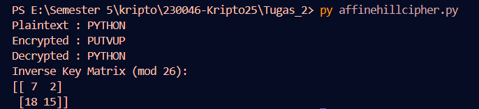

# Hill Cipher Program

## 📌 Penjelasan Alur Program
Program ini dibuat untuk melakukan proses enkripsi, dekripsi, dan pencarian kunci (inverse matrix) pada **Hill Cipher**.

### 1. Enkripsi
- Plaintext diubah menjadi angka (A=0, B=1, …, Z=25).
- Plaintext dibagi menjadi pasangan 2 huruf.
- Tiap pasangan dikalikan dengan matriks kunci K (mod 26).
- Hasilnya dikonversi kembali menjadi huruf → ciphertext.

### 2. Dekripsi
- Menghitung matriks inverse dari K mod 26.
- Ciphertext dibagi menjadi pasangan huruf.
- Tiap pasangan dikalikan dengan matriks inverse (mod 26).
- Hasilnya dikonversi kembali menjadi huruf → plaintext.

### 3. Mencari Kunci Inverse (K⁻¹ mod 26)
- Hitung determinan matriks K.
- Cari invers determinan terhadap 26.
- Hitung matriks adjoin.
- K⁻¹ = (invers determinan × adjoin) mod 26.

---

## 🖥️ Screenshot Running Program
Hasil percobaan dengan `K = [[7,6],[2,5]]` dan plaintext **PYTHON**:

### Screenshot

