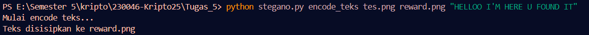
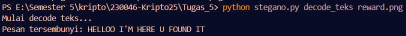
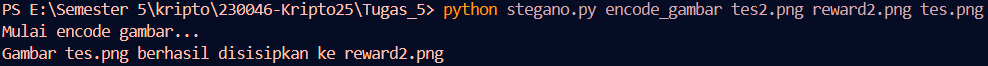
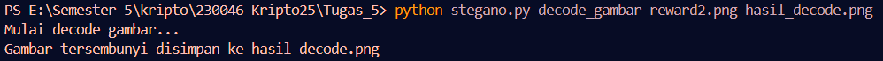

# 🖼️ Steganografi: Encode & Decode Pesan / Gambar

## 📌 Deskripsi
Repository ini berisi **implementasi sederhana steganografi berbasis Python**, yang memungkinkan kamu untuk **menyembunyikan pesan teks atau gambar** ke dalam gambar lain menggunakan metode **Least Significant Bit (LSB)**.

Program ini mendukung dua mode utama:
1. 📝 **Encode / Decode Teks**
2. 🖼️ **Encode / Decode Gambar**

---

## ⚡ 1. Steganografi Teks

### 📖 Penjelasan
- Metode ini menyembunyikan pesan teks ke dalam **pixel gambar (RGB)**.
- Setiap bit dari pesan diubah menjadi bit paling tidak signifikan (LSB) dari nilai warna.
- Proses decode akan membaca kembali bit-bit tersebut dan mengembalikan pesan aslinya.

### 🔑 Konsep Utama
- 1 pixel (3 channel RGB) menyimpan **3 bit data**.
- Pesan teks diubah ke dalam bentuk **bit**, lalu disisipkan dalam setiap pixel.

### 🚀 Contoh Penggunaan
```bash
# Menyembunyikan pesan teks
python stegano.py encode_teks cover.png hasil.png "Ini pesan rahasia"

# Mengambil pesan teks tersembunyi
python stegano.py decode_teks hasil.png
```

---

## ⚡ 2. Steganografi Gambar

### 📖 Penjelasan
- Metode ini menyembunyikan **gambar kecil (secret image)** ke dalam **gambar lain (cover image)**.
- File gambar rahasia dikonversi menjadi byte, kemudian setiap bit-nya disisipkan ke dalam pixel cover image.

### 🔑 Proses
- **Enkripsi (Encode)**: 
  - Ambil gambar cover.
  - Baca file gambar rahasia.
  - Sisipkan datanya bit-per-bit ke cover.
- **Dekripsi (Decode)**:
  - Ambil kembali bit data dari gambar stego.
  - Simpan hasilnya sebagai file gambar tersembunyi baru.

### 🚀 Contoh Penggunaan
```bash
# Menyembunyikan gambar kecil
python stegano.py encode_gambar cover.png hasil.png rahasia.png

# Mengambil kembali gambar tersembunyi
python stegano.py decode_gambar hasil.png hasil_decode.png
```

---

## 🧩 Struktur Program

- `ke_bits()` → Mengubah byte menjadi bit.
- `dari_bits()` → Mengubah bit kembali ke byte.
- `sisip_bit()` → Menyisipkan bit-bit pesan ke dalam pixel gambar.
- `ambil_bit()` → Mengambil bit-bit tersembunyi dari gambar.
- `encode_teks()` / `encode_gambar()` → Melakukan proses penyembunyian.
- `decode_teks()` / `decode_gambar()` → Melakukan proses pengambilan kembali data.

---

## 🖥️ Screenshot Running Program
Hasil percobaan:
- Encode teks:
  `python stegano.py encode_teks tes.png reward.png "isi pesan"`
- Decode teks:
  `python stegano.py decode_teks reward.png`
- Encode gambar:
  `python stegano.py encode_gambar tes2.png reward2.png tes.png`
- Decode gambar:
  `python stegano.py decode_gambar reward2.png hasil_decode.png`

### Screenshot





---

## 🧠 Catatan
- Format gambar **harus PNG** agar tidak kehilangan data LSB saat penyimpanan.
- Jika file hasil decode tidak terbaca sebagai teks, program otomatis menyimpannya sebagai file gambar (`hasil_decode.png`).
